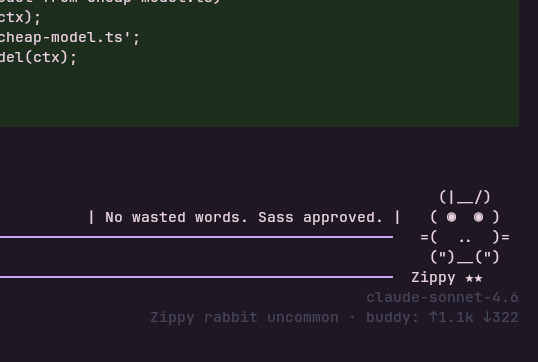
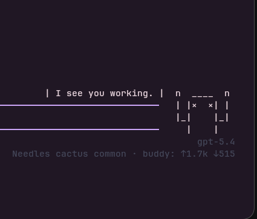

# pi-buddy

> **Experimental** — this extension is a work in progress. Expect rough edges and layout quirks. Pull requests with improvements are very welcome.

<p align="center">
  
  
</p>

A recreation of the Claude Code companion experience for [Pi](https://github.com/badlogic/pi-mono). Based on the idea of the Claude Code buddy — an animated ASCII creature that sits beside your input, reacts to what you are doing, and collects a roster of unique companions over time.

This is not an official project and has no affiliation with Anthropic or Claude Code.

## Install

```bash
pi install git:github.com/NerfEko/PiBuddy
```

Then do `/reload` or restart Pi. On first load, use `/buddy hatch` to get your first buddy.

## Features

- 18 species: duck, goose, blob, cat, dragon, octopus, owl, penguin, turtle, snail, ghost, axolotl, capybara, cactus, robot, rabbit, mushroom, chonk
- 5 rarity tiers: common, uncommon, rare, epic, legendary
- 5 stats per buddy: DEBUGGING, PATIENCE, CHAOS, WISDOM, SNARK
- Contextual reactions after each assistant turn, powered by a cheap model
- One-time soul generation at hatch — unique name and personality
- Roster system — collect multiple buddies and switch between them
- Custom footer showing buddy name, rarity, and token usage

## Commands

| Command | Description |
|---|---|
| `/buddy` | Show buddy card, or hatch one if none exist |
| `/buddy hatch` | Hatch a random new buddy |
| `/buddy spawn <species>` | Spawn a specific species |
| `/buddy list` | Browse your roster |
| `/buddy switch <name>` | Switch active buddy |
| `/buddy card` | View full stat card |
| `/buddy pet` | Pet your buddy |
| `/buddy rename <name>` | Rename active buddy |
| `/buddy delete` | Delete active buddy |
| `/buddy reroll` | Hatch another random buddy |
| `/buddy mute` / `/buddy unmute` | Toggle reactions |
| `/buddy off` / `/buddy on` | Hide or show the buddy |
| `/buddy model` | Pick which model to use for reactions |

Tab completion works on all subcommands and species names.

## Model usage

Buddy AI uses a cheap model auto-detected from your configured providers, in this order:

1. GitHub Copilot: claude-haiku-4.5, gpt-4o, gemini-3-flash-preview
2. Anthropic: claude-haiku-4
3. Google: gemini-2.0-flash, gemini-1.5-flash
4. OpenAI: gpt-4o-mini, gpt-4o
5. Falls back to your active model if none of the above are available

Use `/buddy model` to override the auto-detected model.

All model calls are optional. The buddy works fully offline with local fallback reactions and names.

## Reactions

Reactions are generated using the buddy's name, personality, stats, and a summary of what just happened — including what files changed and what the AI said. This keeps reactions specific to the work rather than generic.

## Token usage

- Soul generation: around 120-220 tokens, once per hatch
- Reactions: around 60-120 tokens per turn, ~70% chance, 1 turn cooldown
- Normal sessions with no new hatches: 0 tokens

## State

Buddy state is stored globally at `~/.pi/pi-buddy/state.json` so your roster persists across all projects.

## Contributing

Pull requests are welcome. Some areas that could use improvement:

- More sprite polish and additional species
- Better reaction quality and more varied local fallbacks
- Settings UI for toggling reaction mode, model preferences, etc.
- Performance improvements to the editor overlay rendering
- Support for themes (rarity colors, etc.)

Please open an issue first for larger changes.
